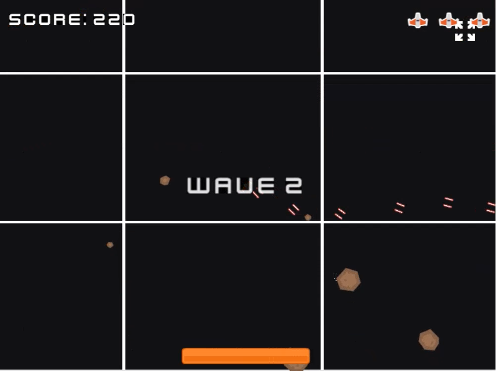
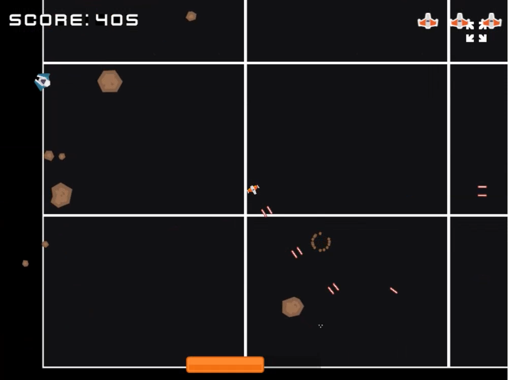
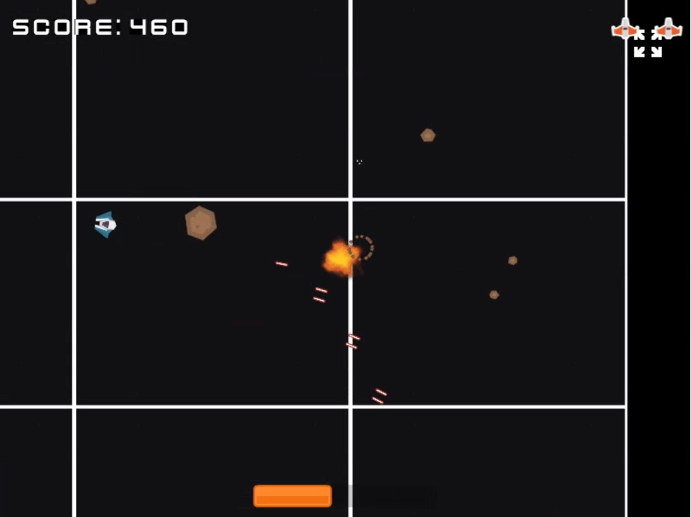

# Shooteroid

Welcome to Shooteroid, a thrilling JavaScript 2D game powered by the [Phaser](https://phaser.io/) game framework. Navigate your spacecraft through vast open space, dodging and shooting incoming asteroids while aiming for the highest score.

## Features

- **Immersive Gameplay:** Experience the thrill of navigating a spacecraft in open space.
- **Dynamic Movement:** Navigate your ship in all four directions to dodge asteroids and explore the open world.
- **Engaging Action:** Shoot incoming asteroids to survive and progress through waves of increasing difficulty.
- **Score and Wave System:** Compete for the highest score and face challenging waves of asteroids.

## Installation

1. Clone the repository:
`git clone https://github.com/zillydev/shooteroid-demo.git`
2. Open the index.html file in your preferred web browser to start playing.

## Controls

- Use the arrow keys (or WASD keys) to navigate the spacecraft.
- Press the spacebar to shoot at incoming asteroids.

## Screenshots

